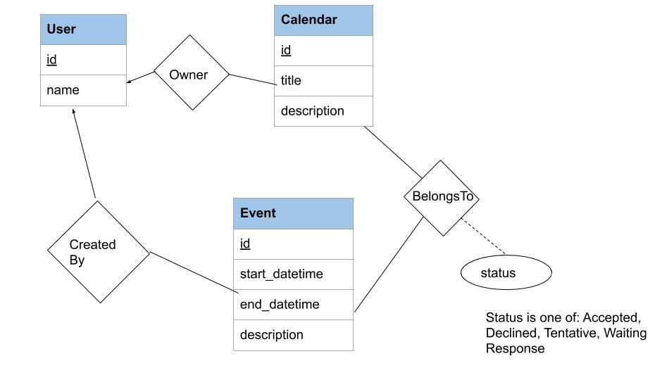

# Assignment 5: SQL and Programming Languages; Web Application Development with Python Django Part 2, CMSC424, Fall 2020

**This assignment is to be done by yourself, but you are welcome to discuss the assignment with others.**

## SQL and Python (1 points)
One of more prominent ways to use a database system is using an external client, using APIs such as ODBC and JDBC, or proprietary protocols.
This allows you to run queries against the database and access the results from within say a Java or a Python program.

As mentioned in the videos, Python has a package called `psycopg2` which provides a similar functionality, although using a proprietary protocol and
not JDBC.

Your task to write a Python program **that will take in JSON updates and insert appropriate data into the database.**  Specifically, the JSON file includes 
partial presidential returns for a few of the counties in a single state. You can see the format of the JSON file in the example file.

If there was already a record for that `particular county, statecode, candidate, year` combination in the `pres_county_returns` relation, you should update that information 
with the new information. But if it is a new county, then a new record should be created in the `pres_county_returns` relation.

There are one type of validations that your code should handle: If the `statecode` does not exist in the `states` relation, it should print out an error message and reject the update.
The message should be: "Invalid statecode STATECODE: updates rejected." (with STATECODE replaced with the correct statecode from the JSON file).

Python has a package called `json` that can do the parsing for you.

The provided `JSONProcessing.py` file already takes care of the input part, and you just need to finish the `processJSON(j)` function. An
example JSON file is provided: `example.json`. You should also look through the `SQLTesting.py` files from previous assignments for examples of how
this package can be used.

## Web Application Development with Python Django: Part 2 (3 points)

Continuing from the previous assignment: Part 2 focuses on updates (to the data), relationships, and model changes. 

### Expanded Application Scenario and the Initial E/R Model

The application scenario here is that of handling an online calendar. The following is the E/R diagram corresponding to the entities and relationships modeled in the application.

The entities here are:
- **Users** who own calendars. A user may own more than one calendar.
- **Calendars** is created and owned by a single user, and contains Events. 
- **Events:**  An event is created by one user, and belongs to one or more calendars. When a user creates a new event, they choose a subset of all the calendars in the system, and `invite` the owners through those calendars. Each of the invited people then choose whether to accept the event or not (including the user who created -- in other words, we allow for the creator of an event to not accept the event).

There are three relationships here:
- **User-to-Calendar**: which records the ownership of calendars. This is recorded implicitly through a ForeignKey constraint.
- **CreatedEvent**: which records who created an event. This is also recorded implicitly through a ForeignKey constraint.
- **BelongsTo**: which records which calendars contain a given event, and the status (Waiting Response, Accepted, Declined, Tentative)

If you open the database using `sqlite3 calendarsite/db.sqlite3`, you can directly see the tables being created. The command `.schema` will show you all the tables that have been created.

The provided application currently has six types of URLs/views/webpages: 
- **mainindex**: Main "index" page, where we simply display a list of users. (example: http://localhost:8888/mycalendar/). Clicking on a user name would take us to `mycalendar/user/user_id`, but that page (`userindex`) is not
implemented yet.
- **userindex**: User "index" page, which shows the list of calendars owned by the user. (example: http://localhost:8888/mycalendar/user/1). 
- **eventindex**: Event "index" page, which shows the details for an event. (example: http://localhost:8888/mycalendar/event/11)
- **calendarindex**: Shows the events in a given calendar, along with the date, time, and status. (example: http://localhost:8888/mycalendar/calendar/1)
- **createevent**: This is the page where a user can create an event by choosing the requisite information, and selecting a group of calendars (example: http://localhost:8888/mycalendar/user/1/createevent)
- (Not implemented) **createcalendar**: This is the page where the user can create a new calendar (example: http://localhost:8888/mycalendar/user/1/createcalendar)

### Task 1 (1 pt)

Implement `createcalendar` by adding appropriate functions in `views.py`. You can use `createevent` as a guideline for that. We have added the first view and the URL entry, as well as the template, but clicking on the submit button will give an error (because the path `/submitcreatecalendar` is not implemented). Redirect to userindex at the end.  

### Task 2 (1pt) 

Our E/R model is pretty simplistic. You need to modify it so it allows representing the following types of information.
- A user should be able to set permissions for each of their calendars, by choosing who else (i.e., which other users) can "see" the events in that calendar.
- An event should be allowed to `repeat` on a schedule. Specifically, for a event, we should be able to record a repeat frequency (daily, weekly, weekly on multiple days, monthly, etc). Just like Google calendar, there should be an end date associated with the repeated events. For simplicity, we will assume that a user has the same statuts for all repetitions of an event (unlike say Google Calendar, which allows me to say Yes to an event today, but no to the repeated event next week).
- For each event, a user should be able to record a "priority" number, i.e., how important is that event for them. (This can be used, e.g., for resolving scheduling conflicts). Priority is a numeric rating between 1 and 5 (5 being highest priority). The priority for the same event may be different for different users (e.g., a specific meeting might be high priority for one user, but low priority for another user).
- Add another type of entity: a `Room`. Events can be scheduled in rooms, so we also need to add the appropriate relationship. The attributes of room include the room number, room name (may be null), and capacity.
- Add another type of entity: a `Company` that a person belongs to. If the person tries to create an event that involves non-company users, this information will help us warn them. Attributes of a company include company name, and address.

Here is a link to the [Google Drawing of the E/R Diagram](https://docs.google.com/drawings/d/1z8ZvOfoRaruk1iJmfivTjazOYLz3N4vF_usgHv7MtHg/edit?usp=sharing) above. You are welcome to copy it and modify it. 

Submit the final E/R diagram as a PDF file (in Assignment 5, Part 1).

### Task 3 (1pt) 
Modify the `models.py` file according to your new E/R models. You are welcome to try to make it work with the rest of the app, but we only need the models.py file, and the grading will be by inspection, not by running it.

Submit the modified `models.py` file (in Assignment 5, Part 1).

### Submission
Zip the `JSONProcessing.py` file, and the following files together into a single zip file and upload it: 
`views.py`, `urls.py`.

NOTE: Submissions for Task 2 and Task 3 above are through Gradescope as file uploads (as part of `Assignment 5, Part 1`).
